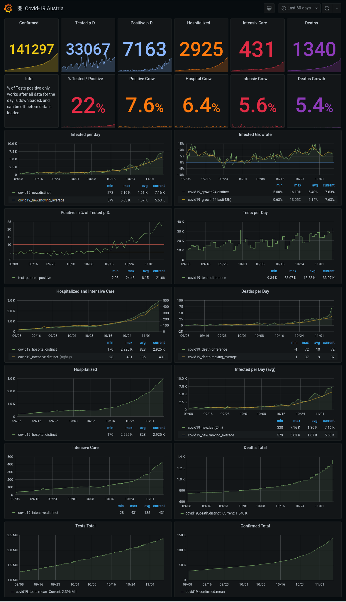

# Covid-19-Austria data import & graphical dashboard

scripts that i use to download and visualize covid-19 related data of austria. maybe it is useful for others too.

It produces a grafana dashboard that looks like this (Snapshot of 06. November 2020):

## Usage

please be aware that this is ripped out of a another data gathering process of mine, i do not use this exact setup, so expect some quirks im not aware of.

also, be aware that currently the Infoboxes in the second row "% Tested / Positive" , "Positive Grow", "Hospital Grow", "Intensive Grow", "Deaths Grow" do not always display the latest value depending the ZoomWindow and current DateTime.

### Requisites

+ docker & docker-compose or compatible (eg. podman & podman-compose)

### setup

+ copy `example.env` to `.env` and edit to your needs
+ start scripts `docker-compose up`
+ import old data `docker-compose exec ./snapshot-2020-11-06.opentsdb`
+ start webbrowser, connect with grafana at https://localhost:3000
+ import dashboard `covid-19-austria.json`

### start
+ start scripts, if not already started: `docker-compose up`
+ start webbrowser, connect with grafana at https://localhost:3000
+ stop scripts: `docker-compose down`

## Implementation

+ `import-covid19-austria.sh`
    + a bash shell script using curl, sed, grep, html2text, python and jinja

    + uses data sources from
        + https://corin.at/ for bmsgpk and ems related data
        + https://www.sozialministerium.at for actual today data

    + to download, combine and convert the data to opentsdb format, to be pasted into InfluxDB (via its opentsdb interface)

+ `covid-19-austria.json` a grafana dashboard ready to query and visualize the imported data

## License

This is free and unencumbered software released into the public domain.

Anyone is free to copy, modify, publish, use, compile, sell, or
distribute this software, either in source code form or as a compiled
binary, for any purpose, commercial or non-commercial, and by any
means.

In jurisdictions that recognize copyright laws, the author or authors
of this software dedicate any and all copyright interest in the
software to the public domain. We make this dedication for the benefit
of the public at large and to the detriment of our heirs and
successors. We intend this dedication to be an overt act of
relinquishment in perpetuity of all present and future rights to this
software under copyright law.

THE SOFTWARE IS PROVIDED "AS IS", WITHOUT WARRANTY OF ANY KIND,
EXPRESS OR IMPLIED, INCLUDING BUT NOT LIMITED TO THE WARRANTIES OF
MERCHANTABILITY, FITNESS FOR A PARTICULAR PURPOSE AND NONINFRINGEMENT.
IN NO EVENT SHALL THE AUTHORS BE LIABLE FOR ANY CLAIM, DAMAGES OR
OTHER LIABILITY, WHETHER IN AN ACTION OF CONTRACT, TORT OR OTHERWISE,
ARISING FROM, OUT OF OR IN CONNECTION WITH THE SOFTWARE OR THE USE OR
OTHER DEALINGS IN THE SOFTWARE.

For more information, please refer to <https://unlicense.org>
